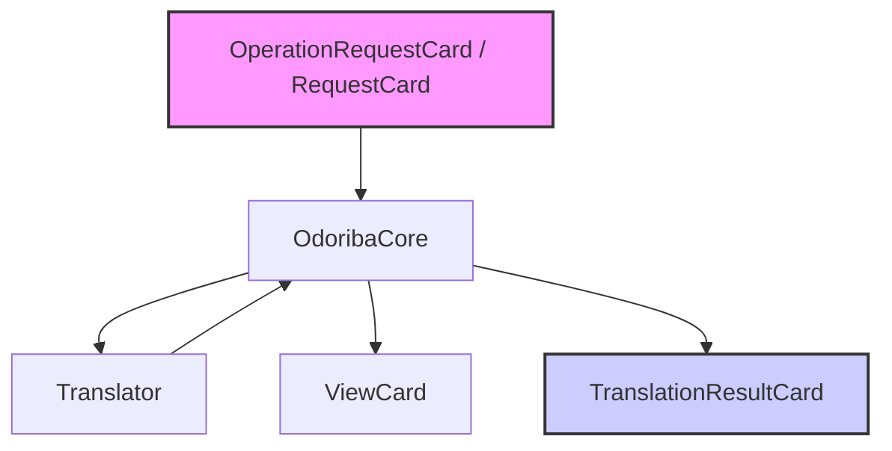

# RRKAL Odoriba 正名準備與邊界規範備忘錄 (RRKAL_odoriba Rename Readiness & Boundary Note)

> [!IMPORTANT]
> **本文件屬性宣告：**
> * **研究定位**：`rename-prep / boundary-mapping only` (僅限正名準備與邊界規劃)
> * **採用前提**：`requires o_1 review before rename activation` (重命名激活前需經由 o_1 審查)
> * **物理邊界**：`no code implementation / no c_4 activation authorized` (尚未授權程式碼實作與 c_4 流程啟動)

---

## 1. 建議專案名稱與副標 (Proposed Repo & Subtitle)
* **專案名稱**：`RRKAL_odoriba` (由原 `vis_2_dis` 更名)
* **副標題**：`RRKAL Odoriba — Card-based Contract Interpretation Layer` (卡片式合約解譯層)

---

## 2. 核心定位 (Core Stance)
`RRKAL_odoriba` 是 RRKAL 的卡片式合約解譯層。它不擁有原始資料、不治理資產生命週期、不執行渲染或壓縮，而是接收已驗證的 Card-based request，透過 `OdoribaCore` 調度受控 `Translator`，將上游已註冊資產或契約解譯成下游可消費的 `ViewCard`，並回傳 `TranslationResult` / `evidence reference`。Odoriba 的目標是降低 `c_1`、`c_2`、`c_3` 之間的 runtime 直接耦合，讓跨層協作經由可審查、可追蹤的卡片訊號完成。

---

## 3. 一段話定義 (One-Paragraph Definition)
Odoriba 是一個中立的、第一版維持無持久狀態的卡片式合約解譯層，作為 RRKAL 體系中各層（包括壓縮、渲染與外部數據源）之間的去耦合神經中樞。它以 `Card` / `Translator` / `TranslationResult` 作為明確契約邊界，避免 `c_1`、`c_2`、`c_3` 直接互吃彼此內部的資料結構，從而降低 runtime 直接依賴與跨 repo 內部格式耦合。

---

## 4. Odoriba 是什麼 (What Odoriba Is)
* **無狀態轉譯器核心**：唯讀解析並轉譯不同組件間的契約資料結構（如 `manifest.json` 與 `render_layer_spec`）。
* **卡片傳遞中心 (Card Exchange Hub)**：統一收發並分配帶有靜態元數據的可審查卡片對象（Cards），維持反射分發。
* **受控 Payload Access Safety Reference**：Odoriba 本身不處理未知 raw data（不作為 Ingestion 層）；但 `Translator` 在 `OdoribaCore` 調度下接觸上游 payload 時，應繼承既有 reference prototype 中的安全防衛原則，例如 path traversal 阻斷、`allow_pickle=False`、尺寸上限與記憶體風險檢查。

---

## 5. Odoriba 不是什麼 (What Odoriba Is Not)
* **不是 Ingestion Layer 或 Cleaning Layer**：不處理未經校驗的原始 raw data。
* **不是渲染器**：不包含任何 Taichi 或 VisPy 的 GPU 著色核心，亦不負責管理底層 3D 視窗。
* **不是壓縮器**：不執行地形高度量化、SSIM 計算或多級 LOD 金字塔的實體生成。
* **不是持久化資料庫**：不維護任何運行期歷史狀態，亦不進行本地 SQLite 數據的直接儲存與修改。
* **不是通用框架**：不提前進行過度設計，不包含任何隱式動態 import 的黑魔法。

---

## 6. 第一版最小反射弧 (First-Version Minimal Reflex Arc)

第一版將嚴格限定在「無狀態對譯與校驗」的反射弧範圍內，由 `OdoribaCore` 統一記錄與回應，其數據流向如下：

* **`RequestCard` (輸入卡)**：承載上游傳遞的解譯與處理請求。
* **`OdoribaCore`**：調度與事件接收中心，負責驗證輸入卡並調度對應的 `Translator`，且做為唯一的結果收集與回應點。
* **`Translator`**：負責執行契約對譯，並將解譯結果回傳給 `OdoribaCore`。
* **`ViewCard`**：描述解譯後的圖層渲染暗示與 LOD 限制。
* **`TranslationResultCard`**：包含 `translator_id`、`source_card_ref`、`output_card_ref`、`status`、以及 `checksum` / `metrics` / `diagnostics` / `evidence refs` 等可選驗證欄位；`RMSE` 等精度指標僅在該 `Translator` 具備 fidelity metric 時出現。

---

## 7. 歷史/參考內容處理方案 (Legacy/Reference Content Handling Plan)
* **原始碼與測試封存**：將現有的 `build_synthetic_terrain_skin.py` 等生成腳本在更名後，移入 `./archive/reference/` 目錄；將 `examples/synthetic_terrain.vizasset` 移入 `./archive/examples/`，作為無狀態解譯器的靜態測試基準。
* **繼承換行符政策**：完整繼承本地建立的 `.gitattributes` 規範，確保工作目錄始終維持 status clean，防範 Windows 換行符自動轉換導致的髒痕污染。

---

## 8. `c_4` 啟動先決條件 (c_4 Activation Prerequisites)
1. **工作區維持乾淨**：本地與遠端 `vis_2_dis` 均已清空換行符髒痕且同步完畢（**已達成**）。
2. **正式更名授權**：獲得 Owner 對於將遠端 GitHub 倉庫與本地資料夾正名為 `RRKAL_odoriba` 的授權。
3. **契約 Schema 對齊**：
   * 與 `c_1` 對齊 `AssetCard` 最小欄位；
   * 與 `c_2` 對齊 `ContractCard` / `CompressionContract` 可用欄位；
   * 與 `c_3` 對齊 `DisplayViewCard` / `LayerViewCard` 最小欄位；
   * 再由 `o_1` 統整 `RequestCard` / `TranslationResultCard` 的共通骨架。
4. **實作授權解除**：獲得 Owner 對於編寫 `CardBase` 基類與最小反射弧代碼的實作批准。

---

## 9. 未授權清單 (Not Authorized List)
* **不在此時進行資料夾重新命名**（保持 `L:\vis_2_dis` 原樣）。
* **不實作任何 Odoriba Python 原始碼**（不建立 `CardBase`、`OdoribaCore` 等）。
* **不修改**三大產品倉庫 `c_1`、`c_2`、`c_3` 的任何代碼。
* **不在此步驟激活 `c_4`** 流程。
* **不引入**依賴注入 (DI) 或語法島的任何實際產品代碼。

---

### 邊界聲明 (Boundary Statement)
> No c_1 / c_2 / c_3 product-mainline changes. vis_2_dis received only a hygiene line-ending policy commit. This note is rename-prep / boundary-mapping only, not product integration.
