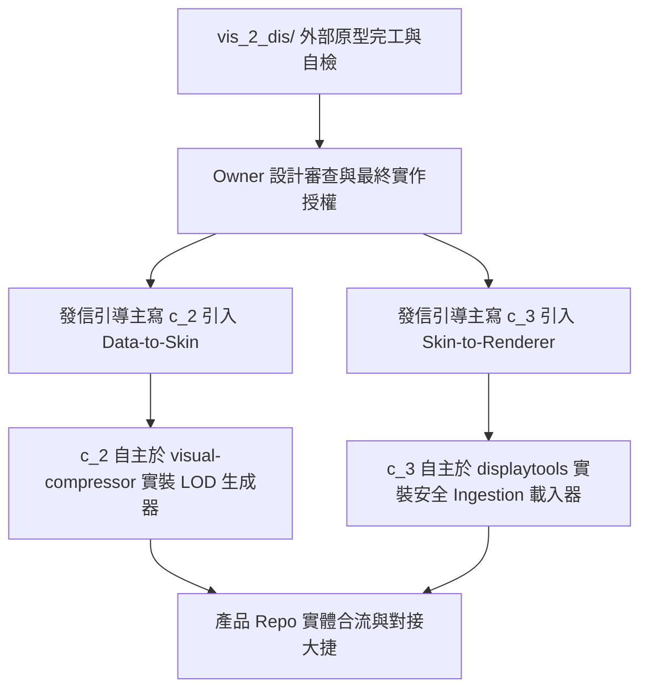

# 唯讀產品整合備忘錄 (Read-only Product Integration Notes)

* **狀態**：架構設計備忘錄 (Architecture Review Memo)
* **目的**：說明如何在主寫與 Owner 確定的產品 Repo **100% 唯讀邊界**下，於未來安全、平滑地將 `./vis_2_dis/` 外部原型的對接成果導入產品主體代碼。

---

## 1. 核心整合策略

我們堅持 AI 架構師 `a_1` **絕不主動修改產品 Repo** 的鐵律。所有的實作代碼主權均歸屬於主寫 Agent 同伴（`c_2` 與 `c_3`）與 Owner。

我們的引導路徑分為以下幾步：

---

## 2. 壓縮端 `c_2` (visual-compressor) 對接引導
* **引入內容**：`build_synthetic_terrain_skin.py` 中的 LOD 金字塔降採樣、`int16` 量化公式與 `manifest.json` Checksums 的自動生成邏輯。
* **實裝位置**：建議 `c_2` 自主於 `rrkal-visual-compressor` 專案中建立 `compressor/skin_builder.py`，作為資產封裝階段的核心工具。

---

## 3. 渲染端 `c_3` (displaytools) 對接引導
* **引入內容**：`validate_renderer_skin_asset.py` 中的**安全 Ingestion 防禦機制**與 `np.load(allow_pickle=False)` 限制，以及 GPU/Taichi 內的反量化與 NoData 過濾。
* **實裝位置**：建議 `c_3` 自主於 `RRKAL_displaytools` 專案中建立 `displaytools/skin_loader.py`，並將其掛載至主渲染器 Ingestion 網關。

---

## 4. 聯調與測試驗證
* 主寫雙端可以使用 `vis_2_dis/examples/synthetic_terrain.vizasset` 作為靜態基準測試包（Benchmark Pack），執行雙向數據讀寫與保真度評測。這能確保在完全不干擾產品 Repo 的前提下，實現完美的異步功能解耦測試！
